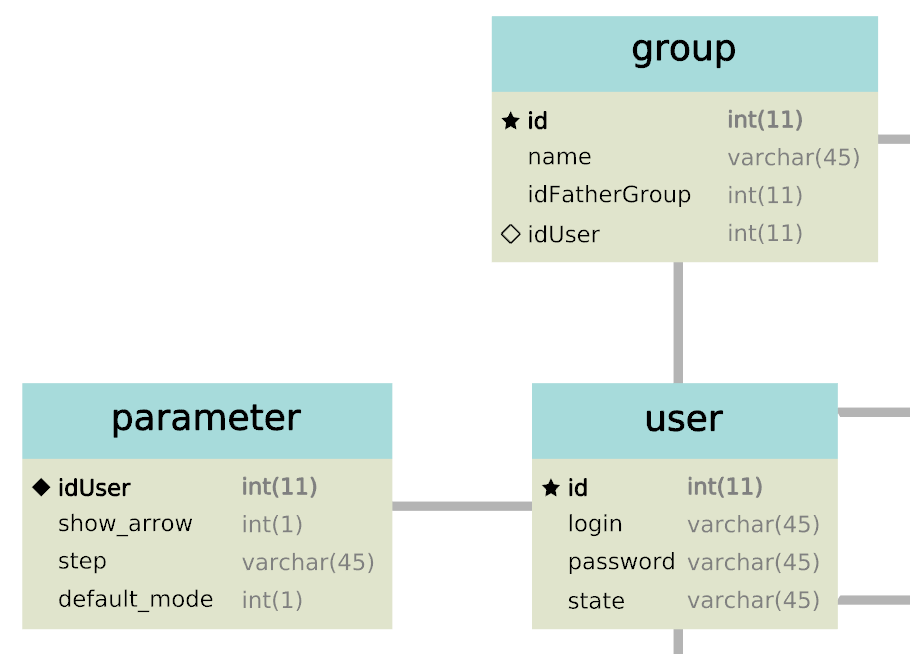

# sql-to-tulip
**sql-to-tulip** is a python project allowing to create a [tulip](http://tulip.labri.fr) graph from a MySQL database creation script.

## Installation
For using **sql-to-tulip**, you have to download the software Tulip available [here](https://sourceforge.net/projects/auber/files/) (for developers, note that you have to install a version supporting the python development).

### Users

### Developers
* Clone the git repository and open it with Tulip
* Launch the file sql-to-tulip.py 

The way how the plugin works is detailed in the *Behavior* section, and the class used are described in the *Structure* section.

## Behavior
The plugin **sql-to-tulip** follows the steps:
	1. Reads the .sql file, generate a graph containning all the data (a node per entity)
	2. Calculates the layout size of each entity (based on the number of attribute, size of the text, etc.) and sets each node with this layout size.
	3. Plannarization algorithm applied.
	4. Adds visually all the data (attribute, type, key, etc.) with a node per data.
	5. Reduce the initial node to a unique size so the the edges have all the same larger.

## Structure
### SqlReader
The *SqlReader* class contains the code allowing to extract the name of the table, the attributes and their information from the SQL script. This classe uses regex to extract by keywords.
The result returns a structure graph, where each node represents an entity, and each edge a relation.
Each created node have the following properties:
* `table_name`(*string*) : name of the entity
* `a_name`(*string[]*)   : list the name of all attributes 
* `a_type`(*string[]*)   : list the type of all attributes
* `a_ispk`(*boolean[]*)  : list of boolean saying if an attribute is a primary key
* `a_isfk`(*boolean[]*)  : list of boolean saying if an attribute is a foreign key

### TableView
The *TableView* class is used to create each table from a node. It creates a visual node for the name and of each attributes. The `compute_size()` function calculates the size of the visual table, based upon the total length of name and attributes strings.

### GraphView
The *GraphView* class sets up the entity-diagram, using the `set_view()` function. This function calls the `TableView.compute_size()` function for each nodes, then set the edges settings, apply a planarization layout algorithm, and finally displays the tables.
The planarization layout algorithm is already countained into Tulip, and calls the [OGDF](http://www.ogdf.net) implementation.

## Visualization
The following picture shows you how the entity are represented in the tulip project.

## Performance test

## Problems/TODOs
* In `SqlReader.add_keys()`, we only manage the instructions called into the *ALTER TABLE* instruction. So, if a primary key is defined into a *CREATE TABLE* instruction, it won't work properly.
